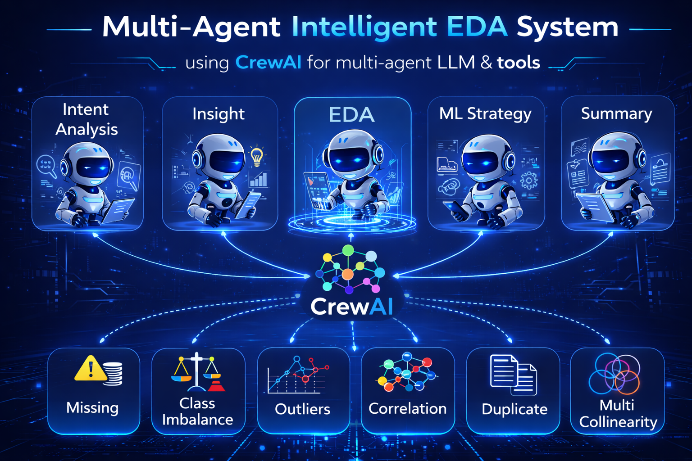

# 🤖 Multi-Agent Intelligent EDA System (MAIES)

Multi-Agent Intelligent EDA System (MAIES) is an AI-powered framework designed to automate exploratory data analysis (EDA), insight extraction, and machine learning strategy formulation using a collaborative multi-agent architecture.  
The system leverages specialized agents to interpret user intent, analyze dataset structure and quality, detect risks, and generate structured outputs for reliable decision-making.  
By combining automated data understanding with intelligent ML recommendations, MAIES accelerates analytics workflows and enhances real-world ML readiness.

## System Preview

<p align="center">
  
</p>


---

## 🎥 Demo Video

[▶️ Watch Demo Video](files/demo.mp4)

---

## ✨ Features

- 🧠 **Intent Interpretation Agent**  
  Understands user objectives and analytical requirements.

- 📂 **Dataset Profiling Agent**  
  Examines schema, data types, missing values, and statistical summaries.

- 🔍 **Pattern & Risk Detection Agent**  
  Identifies anomalies, correlations, outliers, and potential modeling risks.

- 📈 **ML Strategy Formulation Agent**  
  Suggests suitable machine learning approaches based on dataset characteristics.

- 🧩 **Modular Multi-Agent Architecture**  
  Ensures controlled context flow and clean data exchange between agents.

- 🛠️ **Dynamic Tool Execution**  
  Executes analysis tools dynamically for deeper exploration.

- 🧠 **Memory-Driven Context Management**  
  Maintains analytical consistency across steps.

- 🌐 **Interactive Streamlit Dashboard**  
  Displays results in a structured and professional UI.

---

## 🛠️ Tech Stack

| Component        | Technology Used              |
|------------------|------------------------------|
| 🐍 Programming   | Python                       |
| 🤖 LLM           | Groq      |
| 🔗 Agent Framework | CrewAI     |
| 📊 Data Analysis | Pandas, Matplotlib  |
| 🎨 Frontend     | Streamlit                    |

---


## ⚙️ Installation & Setup (Using pip)

1. 📥 Clone the repository:
   ```bash
   git clone https://github.com/Sameer078/MAIES
   cd MAIES
   ```

2. 🧪 Create and activate a virtual environment:
   ```bash
   python -m venv venv
   source venv/bin/activate
   ```
   On Windows:
   ```bash
   venv\Scripts\activate
   ```

3. 📦 Install dependencies:
   ```bash
   pip install -r requirements.txt
   ```

4. 🔑 Set environment variables:
   ```bash
   export GROQ_API_KEY="your_api_key_here"
   ```
   On Windows:
   ```bash
   set GROQ_API_KEY=your_api_key_here
   ```

---

## ⚡ Installation & Setup (Using uv)

`uv` is a fast Python package and environment manager.

1. 📥 Clone the repository:
   ```bash
   git clone https://github.com/Sameer078/MAIES
   cd MAIES
   ```

2. 📦 Initialize the project:
   ```bash
   uv init .
   ```

3. 🧪 Create a virtual environment:
   ```bash
   uv venv
   ```

4. ▶️ Activate the virtual environment:
   ```bash
   .venv/Scripts/activate
   ```
   On macOS/Linux:
   ```bash
   source .venv/bin/activate
   ```

5. 📦 Install dependencies:
   ```bash
   uv add -r requirements.txt
   ```

6. 🔑 Set environment variables:
   ```bash
   export GROQ_API_KEY="your_api_key_here"
   ```
   On Windows:
   ```bash
   set GROQ_API_KEY=your_api_key_here
   ```

---

## ▶️ How to Run the Project

🚀 Start the Streamlit dashboard:

```bash
streamlit run app.py
```

---

## 🧑‍💻 Usage Example

1. 📤 Upload a dataset (CSV format)  
2. 🧠 Agents analyze dataset structure and quality  
3. 📊 System generates statistical summaries  
4. 🔍 Risks and patterns are identified  
5. 📈 ML strategy recommendations are provided  
6. 📑 Structured outputs are displayed in the dashboard  

---

## 🔮 Future Enhancements

- 🌐 Support for multiple dataset formats (Excel, SQL, APIs)  
- 🧠 Advanced feature engineering suggestions  
- 📊 AutoML integration for rapid model prototyping  
- 📈 Interactive chart customization  
- 🔐 Enterprise-ready role-based access control  

---

## 📜 License

This project is licensed under the **MIT License**.
